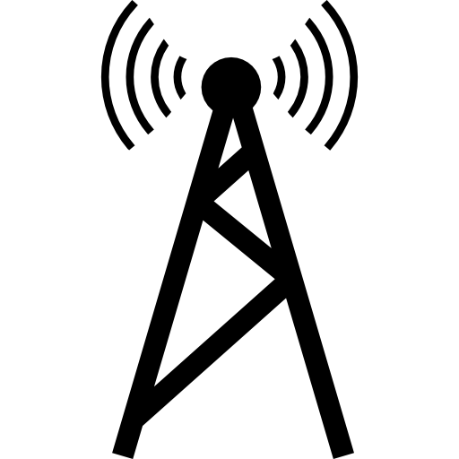

# Station

`@sphinx-software/station`

[](https://app.circleci.com/pipelines/github/sphinx-software/station)


_Abstraction Layer for realtime messaging & push notification_

`yarn`

```shell script
yarn add @sphinx-software/station
```

`npm`

```shell script
npm i -S @sphinx-software/station
```

_This package is server implementation.
For client-side implementation, please check `@sphinx-software/antenna`_

## Contents

- [Getting Started](#getting-started)
  - [Realtime Messaging](#realtime-messaging)
  - [Push Notification](#push-notification)
- [Advance topics](#advance-topics)
  - [How it works](#how-it-works)
  - [Supported services](#supported-services)
  - [Framework integration](#framework-integrations)
    - [express](#express)
    - [Koa](#koa)
    - [NestJS](#nestjs)
    - [TypeORM](#typeorm)
  - [Extending messaging transporter](#extending-messaging-transporter)
  - [Extending notification pusher](#extending-notification-pusher)
- [Best practices](#best-practices)
  - [Understanding `Message` & `Notification`](#understanding-message--notification)
  - [Managing subscriptions](#managing-the-subscriptions)
  - [Managing audience devices](#managing-audience-devices)

# Getting Started

💡 Station is an abstract layer for realtime messaging, staying on top of well-known Firebase services.

## Realtime Messaging

### Minimal example

We support realtime messaging via `Messenger` service.

```ts
import { Messenger, transports } from '@sphinx-software/station'

const messenger = new Messenger(transports.log(console))

messenger.send(
  {
    type: 'greeting',
    payload: {
      hello: 'world',
    },
  },
  'the-world',
)
```

Run the above script, you should see the bellow output in your console

```js
{
  message: { type: 'greeting', payload: { hello: 'world' } },
  channels: [ 'the-world' ]
} Messenger.Transport.Log#send
```

That's it! You've sent a greeting message to `the-world`.

> 💡
>
> A message must have 2 fields:
> `type` accepts a string describing the message type and
> `payload` which is data the message carrying
>
> The `send()` method is returning a `Promise<void>` value
>
> The example above is using the log transport.
> It will do nothing but log the message to the console output,
> which will become handy for testing / debugging.
> For the real world application, [please check the `firestore` transport](#using-firestore-transport).

### Sending a message to a subscriber

In real world application, we usually cooperate an entity with a channel.

For example:

```ts
class User {
  // ... your code here
}
```

We can instruct the messenger that `User` is a `Subscriber`, that can receive a message

```ts
import { Subscriber, SubscriberName } from '@sphinx-software/station'

//

class User implements Subscriber {
  name(): string {
    return new SubscriberName(`user-${this.id}`)
  }
}
```

> 💡
>
> The subscriber name MUST be unique.
>
> We use the `name()` method to identify the subscriber,
> combining the `{type}-{id}` as the name will help you avoid name collision.
>
> The `SubscriberName` is just a helper for generating
> the fully qualified name string with the format: `subscriber-{your subscriber name}`.

Now we can send a message to the user:

```ts
/// Your code to get the user entity
const joe = new User()

///
messenger.send(
  {
    type: 'greeting',
    payload: {
      content: 'Hello',
    },
  },
  joe,
)
```

### The `Message` interface

We also can model our message by implementing the `Message` interface.

```ts
import { Message } from '@sphinx-software/station'

//

class FriendRequest implements Message<{ sender: User }> {
  get type() {
    return 'FriendRequest'
  }

  get payload() {
    return {
      sender: this.sender,
    }
  }

  constructor(private readonly sender: User) {}
}
```

Then send the message as usual

```ts
//

messenger.send(new FriendRequest(joe), jane)
```

### Messaging via topics

Another messaging mechanism is broadcasting messages via topics.
Subscribers subscribing to a topic can receive the messages from it.

We can send a message to a topic using `broadcast` method:

```ts
messenger.broadcast(
  {
    type: 'highscore.new',
    payload: {
      score: 999,
    },
  },
  'highscore',
)
```

Similar to `Subscriber`, implementing `Topic` interface is also available:

```ts
import { Topic, TopicName } from '@sphinx-software/station'

// A post now is a topic.
// So subscribers can listen for new comment for this post.
class Post implements Topic {
  name() {
    return new TopicName(`post-${this.id}`)
  }
}

// When a new comment was made for this post
// we can broadcast the message to the post topic
// so subscribers can get updated
messenger.broadcast(
  {
    type: 'comment.added',
    payload: {
      commentId: comment.id,
    },
  },
  post,
)
```

### Using `firestore` transport

Instead of using `log` transport, we can use the `firestore` transport which can
send messages to the browsers / devices and authorize their subscriptions to private topics.

First let's install `firebase-admin` library

`yarn`

```shell script
yarn add firebase-admin
```

`npm`

```shell script
npm i -S firebase-admin
```

Now, let's initialize the firebase admin application:

```ts
import * as admin from 'firebase-admin'

const app = admin.initializeApp({
  credential: admin.credential.applicationDefault(),
})
```

Then replace the `messenger` initialization script

```ts
// const messenger = new Messenger(transports.log(console))
const messenger = new Messenger(transports.firestore(app))
```

> 💡
>
> Please refer to the [Firebase Documentation](https://firebase.google.com/docs/admin/setup#initialize-sdk) for
> more details about how to initialize `firebase-admin`

## Push Notification

todo docs

# Advance topics

todo docs

## How it works

todo docs

## Supported services

todo docs

## Framework integrations

todo docs

### express

### Koa

### NestJS

### TypeORM

## Extending messaging transporter

## Extending notification pusher

# Best practices

## Understanding `Message` & `Notification`
